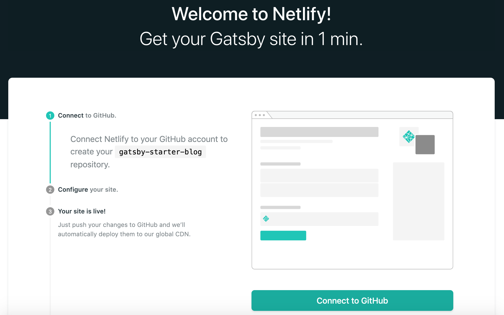
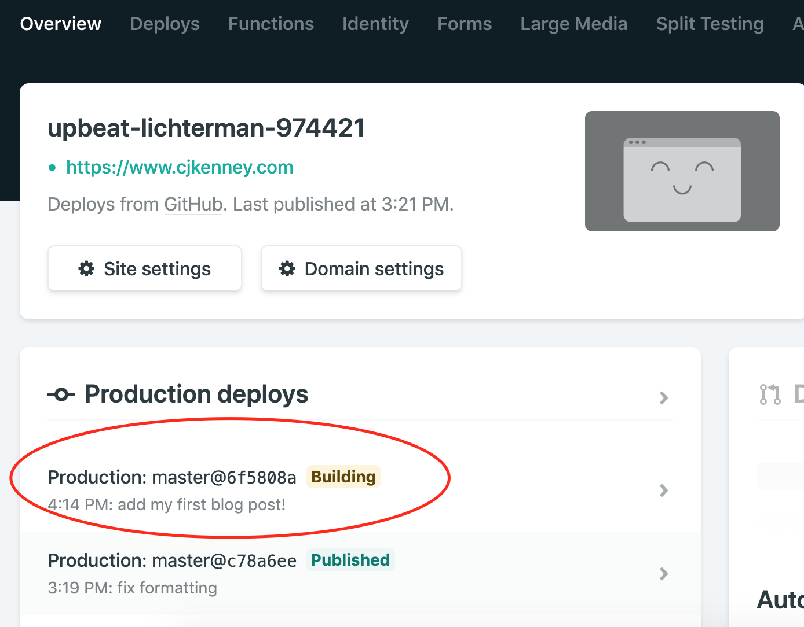

I recently took a trip and rented out a Tesla Model 3. In my deep dive 

### What is You Need a Budget?

[You Need a Budget](https://www.youneedabudget.com) (YNAB) is a
budgeting app based on the "envelope" budgeting system. In this system,
your money is categorized into ..... Imagine setting aside the amount
needed in cash into each of these envelopes. When a payment is due,
reach only for that category's envelope (eg. a "Dining Out" envelope),
to pay for the expense.

#### "You Don't Have to Pay For YNAB"

YNAB has a great [referal
program](https://www.youneedabudget.com/referral-program/) where users
can sign up using your affiliate link. This gives both the new user and
yourself a free month of YNAB. Personally, I didn't want to become a
brand ambassador and hustle a product that my family and friends might
not care for. Instead, let's try to recreate a product that my family
and friends might not care for!

https://agilesysadmin.net/how-to-manage-long-lines-in-vim/ here is the
resource I used for the vim line wrapping

## Layout

## Sorting expense log

In order to enter transactions quickly, YNAB sorts your expenses
automatically by date. For example, if you enter a new expense that
occured a few weeks ago, the YNAB expense sheet will insert that expense
into There is not a built-in way to accomplish this in Google Sheets,
but there are two scripting options:

1. Use the `sort()` function

## Google Query Language (GQL)

I used GQL for SQL-like queries in the spreadsheet. For example, the
calculations of inflow and outflow totals for each category lends itself
to a (wording?) GROUP BY statement. Here's how to do it in GQL:

``` Example table, query, and result```TODO

## Limitations

### Logging

Script builder has logging for the purpose of development, but there is
no way (CHECK THIS) to access these logs from the sheet. My onEdit()
function that sorts transactions by date stopped working when editing
the sheet's layout. The logger swallows these error messages. I couldn't
find a way to catch them when in the spreadsheet UI.

### No Dynamic Data Validation Dropdown Options

Choosing the "List of Ranges" for the transaction log categories did not
allow for multiple ranges.

The best way I found to add all of the budget categories to the dropdown
selection box in the transaction log was to use named ranges. This
creates a manual dependency when a user wants to create a new category.
For example, if a user wants to add a "Pet Supplies" category, they will
need to add

`=TEXTJOIN(",",TRUE,ImmediateObligations,CreditCardPayments)`

## Notes

- For data validation, I found that the "Reject input" setting for
  invalid data suited my needs much better than the "Show warning"
option. The latter did not auto-complete input when typing a selection.
- Use "Command+;" to insert the current date in a cell


####
Welcome to my first blog post! I thought it would be a great
introduction to show how I built this blog. Let's get into it.

### What is GatsbyJS?

Gatsby is a static site generator that has gained a lot of attention
([and a lot of funding](https://www.gatsbyjs.org/blog/2019-09-26-announcing-gatsby-15m-series-a-funding-round/))
in the past couple of years. It gives developers the necessary tools
to create polished and performant static sites, free of databases
or server-side code.

### Well, why not use plain HTML/CSS/JavaScript?

With Gatsby, a developer can utilize modern development tools and build UIs with [React](https://reactjs.org),
bundle assets with [Webpack](https://webpack.js.org), and dip their
toes into [new web architectures](https://jamstack.org).

In the end, Gatsby outputs only the core data your site needs, with some performance gains for the end user.
Plain HTML, CSS, and JS are generated at build-time, not during run-time like some other JS libraries.

A lot of features come "pre-baked" with Gatsby as [plugins](https://www.gatsbyjs.org/plugins/)
that would be time consuming to create on your own. One of the most important plugins is
an image processer, [gatsby-image].

## Let's Build!

### Setup your development environment

Gatsby provides a great introduction to [setting up your environment](https://www.gatsbyjs.org/tutorial/part-zero/).
I'll give a summary here:

- [GitHub](https://github.com/) Account
  - This is where your blog will live.
- Install [Git](https://git-scm.com/downloads) for your operating system.
- [Netlify](https://www.netlify.com) Account
  - Netlify will host your blog and update as you push changes up to your GitHub repository.
- [NodeJS LTS](https://nodejs.org/en/) - I used Node version 10.6.3 at the time of writing.
  - JavaScript Runtime. Installing Node will install [npm](https://www.npmjs.com) as well.
- [Gatsby CLI](https://www.gatsbyjs.org/tutorial/part-zero/#using-the-gatsby-cli) (Command Line Interface)
  - Install via: `npm install -g gatsby-cli`
  - This will be your main way to interface with Gatsby.

### One-click install

Whew . . . that was a lot of installs. Thankfully now you're
only 2 minutes away from having a live website! (Really!)

Head to [this GitHub repo](https://github.com/gatsbyjs/gatsby-starter-blog) and look
for the "Deploy to netlify" button. All you have to do now is name a repository
and your site will be live!




Netlify will generate a name for your site.
Mine here is `upbeat-lichterman-974421`. You can now access your site
at `[yourSiteName].netlify.com`!


### Create your first blog post!

Navigate to your new repository on GitHub and `git clone` the repository to your
local machine. Open the repository in a text editor [like VS Code](https://code.visualstudio.com/) and use these steps
to start live-editing.

- `cd` into your project location
  - For example: `cd ~/my-code/my-website-repository`
- Install your dependencies
  - `npm install`
- Run your Gatsby development server
  - `gatsby develop`
  - You can now view
    a preview of the site on `http://localhost:8000`

Feel free to explore around the site! The preview look like this:


You'll find the blog posts written in Markdown in this folder:

    .
    ├── content/blog/
    └── . . .

The easiest way to make your first post is to edit one of the existing posts.
Open the `.md` file in an editor, change the title, timestamp, and content, then save.
If you're watching the terminal after you run `gatsby develop` as you
save the changes, you'll see a changelog of the markdown file.

Once you're happy with the changes, add the files to your Git repository.

- `git add -A`
  - Add all of the changed files to the Git index
- `git commit -m "add my first blog post!"`
  - Create a Git commit
- `git push`
  - Pushes your Git commit to the remote repository (GitHub)

Once you push the changes to the repository, log in to Netlify and you will see your
new changes being applied to your site.


