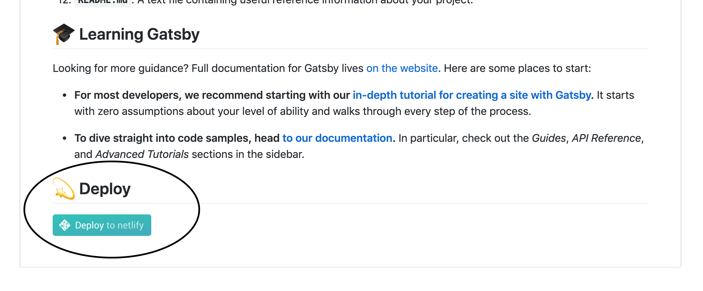
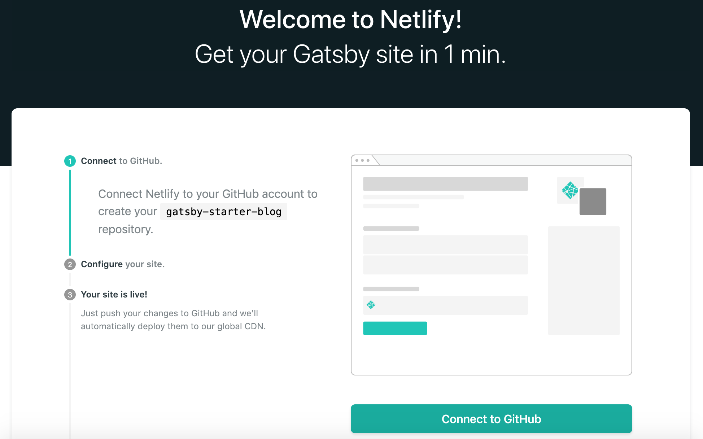
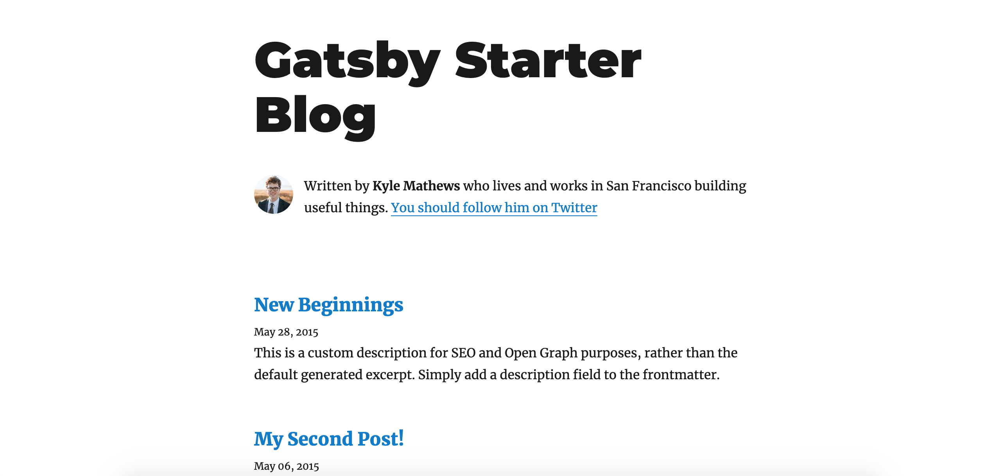

Welcome to my first blog post! I thought it would be a great introduction
to show how I built this blog. Let's get into it.

### What is GatsbyJS?

Gatsby is a static site generator that has gained a lot of attention
([and a lot of funding](https://www.gatsbyjs.org/blog/2019-09-26-announcing-gatsby-15m-series-a-funding-round/))
in the past couple of years. It gives developers the necessary tools
to create polished and performant static sites, free of databases
or server-side code.

### Well, why not use plain HTML/CSS/JavaScript?

With Gatsby, a developer can utilize modern development tools and build UIs with [React](https://reactjs.org),
bundle assets with [Webpack](https://webpack.js.org), and dip their
toes into [new web architectures](https://jamstack.org).

In the end, Gatsby outputs only the core data your site needs, with some performance gains for the end user.
Plain HTML, CSS, and JS are generated at build-time, not during run-time like some other JS libraries.

A lot of features come "pre-baked" with Gatsby as [plugins](https://www.gatsbyjs.org/plugins/)
that would be time consuming to create on your own. One of the most important plugins is
an image processer, [gatsby-image].

## Let's Build!

### Setup your development environment

Gatsby provides a great introduction to [setting up your environment](https://www.gatsbyjs.org/tutorial/part-zero/).
I'll give a summary here:

- [GitHub](https://github.com/) Account
  - This is where your blog will live.
- Install [Git](https://git-scm.com/downloads) for your operating system.
- [Netlify](https://www.netlify.com) Account
  - Netlify will host your blog and update as you push changes up to your GitHub repository.
- [NodeJS LTS](https://nodejs.org/en/) - I used Node version 10.6.3 at the time of writing.
  - JavaScript Runtime. Installing Node will install [npm](https://www.npmjs.com) as well.
- [Gatsby CLI](https://www.gatsbyjs.org/tutorial/part-zero/#using-the-gatsby-cli) (Command Line Interface)
  - Install via: `npm install -g gatsby-cli`
  - This will be your main way to interface with Gatsby.

### One-click install

Whew . . . that was a lot of installs. Thankfully now you're
only 2 minutes away from having a live website! (Really!)

Head to [this GitHub repo](https://github.com/gatsbyjs/gatsby-starter-blog) and look
for the "Deploy to netlify" button. All you have to do now is name a repository
and your site will be live!

Netlify will generate a name for your site.
Mine here is `upbeat-lichterman-974421`. You can now access your site
at `[yourSiteName].netlify.com`!

### Create your first blog post!

Navigate to your new repository on GitHub and `git clone` the repository to your
local machine. Open the repository in a text editor [like VS Code](https://code.visualstudio.com/) and use these steps
to start live-editing.

- `cd` into your project location
  - For example: `cd ~/my-code/my-website-repository`
- Install your dependencies
  - `npm install`
- Run your Gatsby development server
  - `gatsby develop`
  - You can now view
    a preview of the site on `http://localhost:8000`

Feel free to explore around the site! The preview look like this:

You'll find the blog posts written in Markdown in this folder:

    .
    ├── content/blog/
    └── . . .

The easiest way to make your first post is to edit one of the existing posts.
Open the `.md` file in an editor, change the title, timestamp, and content, then save.
If you're watching the terminal after you run `gatsby develop` as you
save the changes, you'll see

1.  **`/node_modules`**: This directory contains all of the modules of code that your project depends on (npm packages) are automatically installed.

2.  **`/src`**: This directory will contain all of the code related to what you will see on the front-end of your site (what you see in the browser) such as your site header or a page template. `src` is a convention for “source code”.
