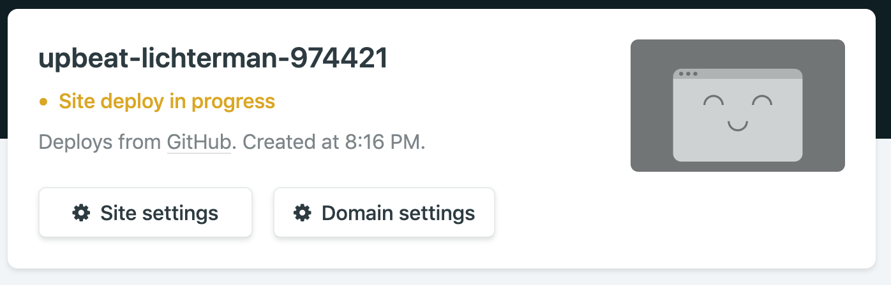

Welcome to my first blog post! I thought it would be a great introduction
to show how I built this blog.

### What is GatsbyJS?

[Gatsby](https://gatsbyjs.org) is a free and open-source framework that helps developers build static sites. It gives developers tools
to create polished and performant static sites, free of databases
or server-side code.

### Why not use plain HTML for a blog?

With Gatsby, a developer can utilize modern development tools and build UIs with [React](https://reactjs.org),
bundle assets with [Webpack](https://webpack.js.org), and dip their
toes into [new web architectures](https://jamstack.org).

Gatsby outputs only the core static files your site needs along with performance gains.

A lot of features come pre-baked with Gatsby as [plugins](https://www.gatsbyjs.org/plugins/)
that would be time consuming to create on your own. One of the most useful plugins is
an image processor, [gatsby-plugin-image](https://www.gatsbyjs.com/plugins/gatsby-plugin-image), which automatically handles image lazy-loading and responsiveness.

## Let's build!

### Setup your development environment

Gatsby provides a great introduction to [setting up your environment](https://www.gatsbyjs.org/tutorial/part-zero/).
I'll give a summary of what's required here:

- [GitHub](https://github.com/) Account
  - GitHub will hold the code, images, and content the site will use to build.
- [Git](https://git-scm.com/downloads)
  - Version control software.
- [Netlify](https://www.netlify.com) Account
  - Netlify will host your blog and update as you push changes up to your GitHub repository.
- [NodeJS LTS](https://nodejs.org/en/)
  - JavaScript Runtime. Installing Node will also automatically install [npm](https://www.npmjs.com).
  - Note: I used Node version 10.6.3 at the time of writing.
- [Gatsby CLI](https://www.gatsbyjs.org/tutorial/part-zero/#using-the-gatsby-cli)
  - Install via: `npm install -g gatsby-cli`
  - This will be your main way to interface with Gatsby.

### One-click deploy

Head to [this GitHub repo](https://github.com/gatsbyjs/gatsby-starter-blog) and look
for the "Deploy to netlify" button. All you have to do now is name a repository
and your site will be live!

Netlify will generate a name for your site.
Mine here is `upbeat-lichterman-974421`. You can now access your site
at `[yourSiteName].netlify.com`!

### Create your first blog post

Navigate to your new repository on GitHub and `git clone` the repository to your
local machine. Open the repository in a text editor [like VS Code](https://code.visualstudio.com/) and use these steps
to start live-editing.

- `cd` into your project location
  - For example: `cd ~/my-code/my-website-repository`
- Install your dependencies
  - `npm install`
- Run your Gatsby development server
  - `gatsby develop`
  - You can now view
    a preview of the site on `http://localhost:8000`

Feel free to explore around the site! The preview look like this:

You'll find the blog posts written in Markdown in this folder:

    .
    ├── content/blog/
    └── . . .

The easiest way to make your first post is to edit one of the existing posts.
Open the `.md` file in an editor, change the title, timestamp, and content, then save.
If you're watching the terminal after you run `gatsby develop` as you
save the changes, you'll see a changelog of the markdown file.

Once you're happy with the changes, add the files to your Git repository.

- `git add -A`
  - Add all of the changed files to the Git index
- `git commit -m "add my first blog post!"`
  - Create a Git commit
- `git push`
  - Pushes your Git commit to the remote repository (GitHub)

Once you push the changes to the repository, log in to Netlify and you will see your
new changes being applied to your site.

Enjoy your new blog!
